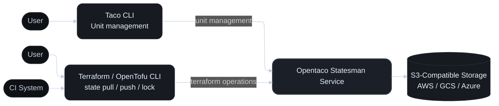

The Statesman service sits between user and the bucket where states are stored. It provides a REST API for managing the state Create Update Delete operations.
The core concept in the statesman service is a "unit" which can be thought of as a versioned statefile. In addition it offers the ability to grant permissions to different users
on the units so some users are only able to read the state only but not write to it, for example. The other actions you can do is list state versions history of a unit and rollback.

The architecture of Statesman service is as follows.

## 1. S3 Compatible Storage (Storage Layer)

This can be any S3 compatible storage such as an S3 bucket on AWS or a GCP bucket or Azure blob storage. It is used to store
the state files and all the additional metadata required for units to function correctly.

## 2. OpenTaco Statesman Service

The statesman service is a REST API service that provides a simple interface for managing the state files and units. Each operation
will end up performing some reads or writes to the storage layer.

## 3. Clients

Currently the main client is a cli with several expansion points including a web UI. The CLI for perfoming operations on units is called taco CLI.
The other cli which also interacts with statesman is the terraform/opentofu cli. This is used during operations such as plan or apply to pull, push or lock the statefile.
The current API is TFE compatible which makes it possible to "terraform login" into the statesman service and use the cloud block in terraform configurations.
