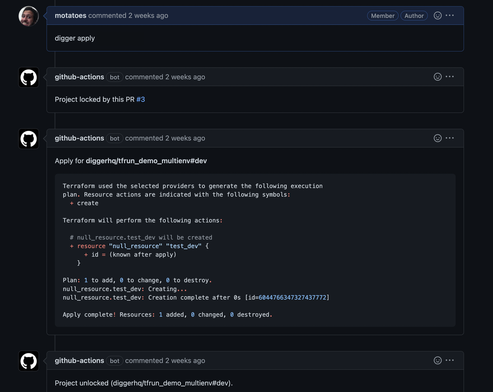

# GCP

In this tutorial we will be using a repository in order to configure a terraform pipeline [https://github.com/diggerhq/digger-gcp-lock-demo](https://github.com/diggerhq/digger-gcp-lock-demo). In order to use GCP with Digger we follow the steps below:

Let's create our first pull request with a change and see this in action:

1. Fork the [demo repository](https://github.com/diggerhq/digger-gcp-lock-demo)
2. Enable Actions (by default workflows won't trigger in a fork)

<figure><figcaption></figcaption></figure>

3. In your repository settings > Actions ensure that the Workflow Read and Write permissions are assigned - This will allow the workflow to post comments on your PRs

<figure><figcaption></figcaption></figure>

4.  Add environment variables into your Github Action Secrets (cloud keys are a requirement since digger needs to connect to your account for coordinating locks). Use[ this guide](https://developers.google.com/workspace/guides/create-credentials) to get the value for it:&#x20;

    <figure><figcaption></figcaption></figure>
5. make a change in `main.tf` and create a PR - this will create a lock

<figure><figcaption></figcaption></figure>

6. comment `digger plan` - terraform plan output will be added as comment. If you don't see a comment (bug) - check out job output

<figure><figcaption></figcaption></figure>

6. create another PR - plan or apply won’t work in this PR until the first lock is released
7. You should see `Locked by PR #1` comment. The action logs will display "Project locked" error message.

<figure><figcaption></figcaption></figure>

8. Lets apply the first PR and merge it to unlock the flow for our colleagues

<figure><figcaption></figcaption></figure>

**Conclusion**

In this tutorial we reused an existing sample repository to set up our first collaborative terraform environment which allows us to collaborate with our team and run terraform changes safely without conflicts.

