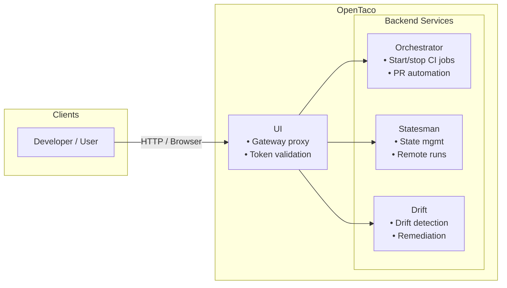

Before OpenTaco the project was called digger and it consisted of purely a piece for PR automation. This engine was responsible for
integrating with github actions and running CI jobs with terraform in response to certain events. We call this the PR Automation or "orchestrator" service.

The same engine now became part of the OpenTaco suite and continues to be improved.

The OpenTaco architecture consists of these components:

- Statesman: Offers states management and remote runs capabilities
- Drift: All drift detection capabilities including detection and remediation
- Token: A token validation service (internal)
- Orchestrator (formerly digger): Responsible for starting and stopping CI Jobs, currently responsible for all of PR automation.
- UI: the UI layer, also acts as a gateway proxy to the other services

