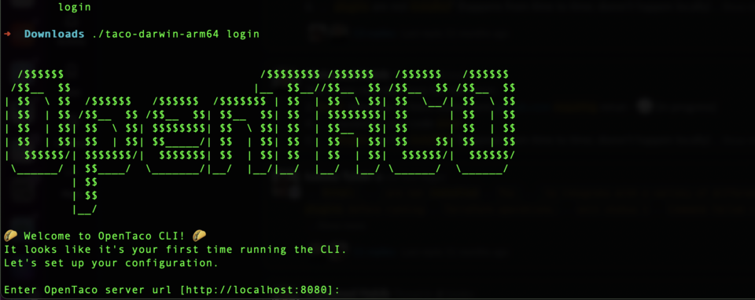

# The OpenTaco Project is now public

Last week, we launched the OpenTaco project. Loads of feedback received, mistakes made, lessons learned. One thing is clear, an open, self hostable alternative to TACOS is definitely needed.  

# Learnings from the launch.

There were 2 things in particular that required fixing, one has been acknowledged and fixed, the other is a WIP, and will be fixed in the coming days.

1. Code-Reuse without attribution: How we dealt with it is documented in detail [here](https://blog.digger.dev/post-mortem-opentaco-using-code-from-otf-without-attribution/), but the TL;DR is that we reused code from the Open Terraform Framework community project and did not provide any attribution. Actions taken include:

    1. Attributions added for the code borrowed from the OTF project - [PR#2262](https://github.com/diggerhq/digger/pull/2262/files?ref=blog.digger.dev).
    2. Digger project changes license from Apache 2.0 to MIT - [PR#2263](https://github.com/diggerhq/digger/pull/2263?ref=blog.digger.dev).
    3. Attribution guidelines update to include explicit attribution requirements - [PR#2264](https://github.com/diggerhq/digger/pull/2264?ref=blog.digger.dev)
    
    Now this meant that some of the code in Digger’s repo was still MPL licensed, and that switching from an Apache to MIT license isn’t straightforward technically (As all contributors would need to provide explicit consent!). We’ve re-written the MPL licensed code to make it MIT compatible, and regarding licensing, we’d be “dual” licensed for the interim, apache + MIT, with an aim to move to fully MIT eventually. IANAL, but moving to a *more* permissive license should not have objection from external contributors, but unfortunately, the OSS community has a lot of examples of a license change in the opposite direction but not many moving to a more permissive one!
    
2. Calling OpenTaco an “Open Standard” isn’t quite accurate! 

    Well, admittedly, this means quality of thinking on naming/positioning needs to go up on our end, but that said, the good part about this is that we can change it. Some suggestions include calling it a toolkit, toolchain or a framework. Before the next launch, we’d have to update this too! A github issue has been created for this: https://github.com/diggerhq/digger/issues/2267

# Some cool stuff that we’re excited about

1. OpenTaco has a cool new splash screen!

2. There’s a WIP SQLite proof of concept, which should be pushed to prod soon. [breardon2011](https://github.com/breardon2011) has been COOKING!

Draft PR here:** https://github.com/diggerhq/digger/pull/2265

Demo here:

https://www.loom.com/share/caaf9e65c26f496f908b7667cd1fb00f

3. TAB calls continue to yield helpful feedback - we’re following the “technical advisory board” framework from Adam Frankl’s “[The developer facing startup](https://www.amazon.co.uk/Developer-Facing-Startup-market-developer-facing/dp/B0D4KGHQML)”. A considerable amount of effort is currently being put into being “[Self hosted first](https://www.notion.so/Metric-Digger-2808cc53bb5a800bbffbd4b5d90cf8c8?pvs=21)”. 

# More questions from the community

There were more questions from the community, summed up below:

> [**Utpal Nadiger**](https://www.linkedin.com/in/utpalnadiger/) interesting. I feel like I'm confused on where digger starts and the OpenTaco idea ends. Is OpenTaco something that bolts onto any TACO? Only Digger? Is Digger rebranding to OpenTaco?

As I replied to the comment, most of this will be clear as we launch further iterations of OpenTaco, but:

The tool that exists as of today will continue to exist and be maintained actively.

The way we see it, there are two camps, one that wants the full-fat experience and one that wants the lightweight one. To truly make a difference, we’d need to compete on both fronts, and that’s what the OpenTaco effort is about. The way it works today in available tooling in the market is that one experience is a first class citizen and the other isn’t.

Dedicated, continuous maintenance on both experiences will continue, both licensed permissively. Both opinionated in their own right while still providing users optionality.

The lightweight experience is pretty mature, the full-fat is very much a WIP. Our plan is to make it a unified, open experience for all users. 

For the rest, I guess action produces information!
