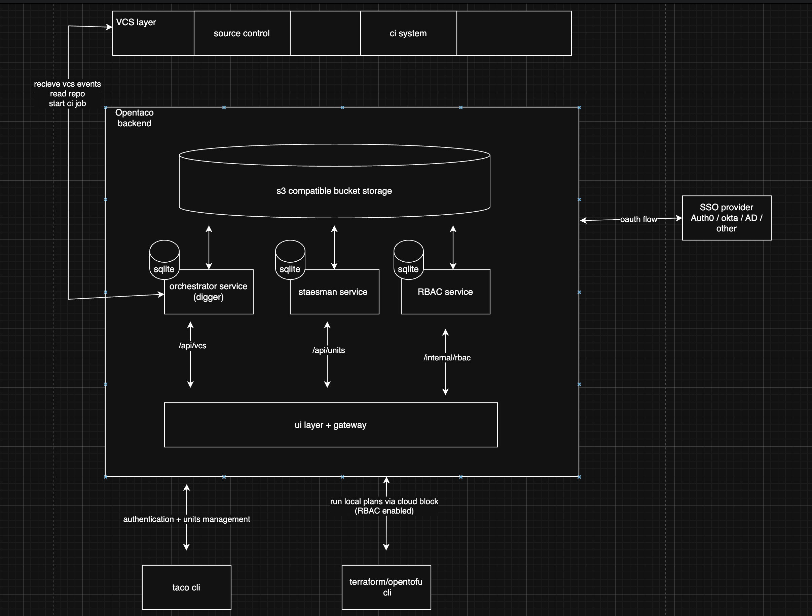
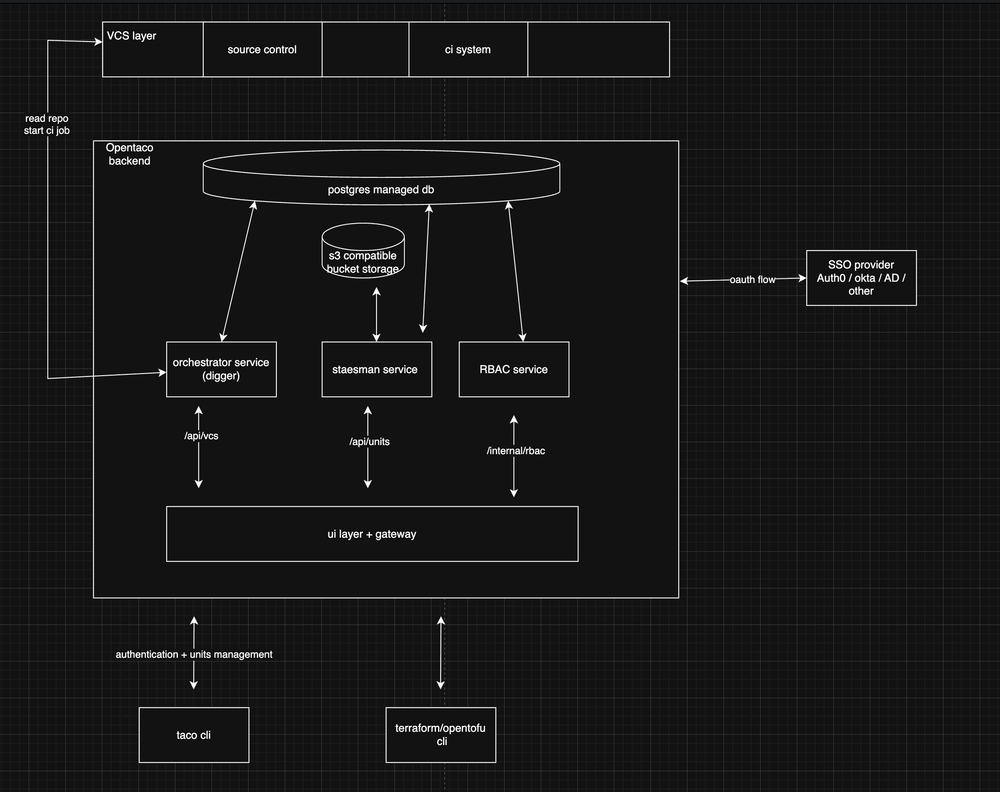

## We’ve been cooking

October Edition of Fieldnotes! (I don’t know how many we can get in every month, but at least 1 is what we’re aiming for)

We went back to the drawing board after the last launch. Well, some things are extremely clear now, Digger the Open Source project will become Opentaco, while Digger the parent company continues to be called so. This is simply much easier from a brand recall POV, and a truly “Open Taco” doesn’t yet exist, so why the hell not!

Secondly, as mentioned in our last fieldnote, it was (rightly) flagged by users that OpenTaco being called a standard isn’t quite accurate. In all messaging going forward, we’re going to be calling OpenTaco a “Toolkit” to better reflect the thinking behind the project. 

We’re also sponsoring OpenTofu day at Kubecon & we’re extremely excited about that, Mo will be speaking about “Stretching the limits of S3 backend for OpenTofu” on stage!!

We’ve been heads down working on v0.1 of OpenTaco! In the last edition I spoke about how we’re aiming to go “self hosted first”. Here’s how the BTS looked in making this happen(to most folks this will seem out of context but fieldnotes is for the nerds anyways!

## Self Hosted First Architecture

In this architecture we will rely only on the bucket. Multiple services will get their own “sqlite” instance in the dbless mode. In managed db mode we can have one db instance with multiple schemas (each schema used by its own service to query it). The web UI also acts as a gateway. The “opentaco backend” is only exposable to a single external endpoint and it handles routing to the the internal components. All traffic first goes to the gateway which forwards on to the right service after checking for the right RBAC checks

# Without managed postgres “DBless”

# With managed postgres

Decisions to be made:

- Seems that vite + tanstack is a better option to allow for complete self hostability (over next.js) maybe we should consider that? (spoiler: we did)
- After introducing the webui + gateway how would the oauth bounce look like? Would we still use a “native app” or a “web flow app” on the SSO provider side? (In order to keep things simpler we rely on oauth using web flow and external identity provider, and we have an internal token service that the users can use to generate “api tokens” - this solution seems to work very well)

There’s a launch coming up pre kubecon with the v0.1 release where users get to try a more unified experience of OpenTaco. The tool is now entirely self hostable which is a MASSIVE win. Onwards we move!
